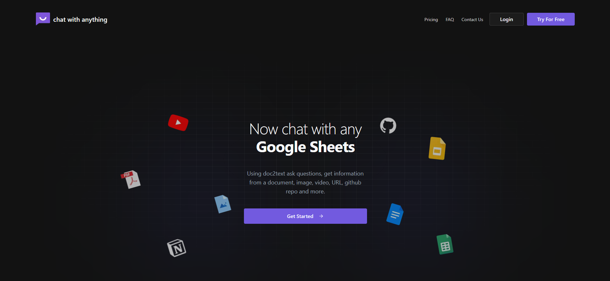
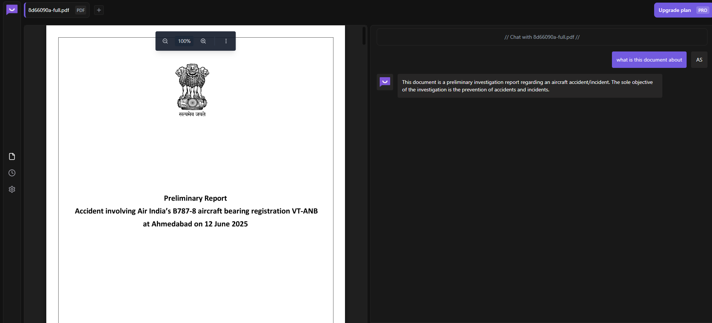

# Chat With Anything

AI-powered document chat application with intelligent conversation and multi-format support

🚀 **Live Demo**
Visit [chat-with-anything.vercel.app](https://chat-with-anything.vercel.app) to see the application in action.



## 📝 Project Overview

Chat With Anything is a modern AI-powered application that enables users to have intelligent conversations with various types of content. Beyond basic document viewing, Chat With Anything offers AI-powered document processing, intelligent chat capabilities, and support for multiple file formats including PDFs, documents, spreadsheets, presentations, images, YouTube videos, and web URLs.



## ✨ Key Features

### 🔐 Secure Authentication
- **Supabase Authentication** - Email & password authentication
- **Session Management** - Secure user sessions and data protection

### 📄 Multi-Format Document Support
- **PDF Documents** - Full text extraction and chat capabilities
- **Microsoft Office Files** - Word, Excel, PowerPoint support
- **Google Workspace** - Docs, Sheets, Slides integration
- **Images** - Visual content analysis and discussion (coming soon)
- **YouTube Videos** - Transcript extraction and video-based conversations
- **Web URLs** - Web page content processing and chat
- **GitHub Repositories** - Code analysis and discussion (coming soon)
- **Notion Pages** - Knowledge base integration (coming soon)

### 🤖 AI-Powered Capabilities
- **Intelligent Document Processing** - Automatic text extraction and vector indexing
- **Conversational AI Assistant** - Context-aware chat with document content
- **Real-time Chat Interface** - Seamless conversation experience
- **Document Viewer** - Integrated viewing with chat functionality
- **Vector Search** - Pinecone-powered semantic search capabilities

### 🎨 Modern User Interface
- **Responsive Design** - Works seamlessly on desktop and mobile
- **Dark Theme** - Modern, eye-friendly interface
- **Real-time Updates** - Live message synchronization
- **File Upload Modal** - Intuitive file and URL input system

## 🛠️ Technology Stack

### Frontend:
- **Next.js 15** - React framework for production
- **TypeScript** - Type-safe JavaScript development
- **Tailwind CSS** - Utility-first CSS framework
- **shadcn/ui** - Reusable component library
- **Radix UI** - Accessible component primitives

### Backend & Services:
- **Supabase** - Authentication, database, and file storage
- **Google Gemini AI** - AI conversation and document processing
- **Pinecone** - Vector database for semantic search
- **LangChain** - Document processing and AI orchestration

### Development Tools:
- **React Query (TanStack Query)** - Server state management
- **React Hook Form** - Form handling and validation
- **Zod** - Schema validation
- **ESLint** - Code quality and consistency

## 🚦 Getting Started

### Prerequisites
- Node.js (v20 or later)
- npm or yarn
- Supabase account
- Google Cloud account (for Gemini AI)
- Pinecone account

### Installation

1. **Clone the repository:**
```bash
git clone https://github.com/yourusername/chat-with-anything.git
cd chat-with-anything
```

2. **Install dependencies:**
```bash
npm install
# or
yarn install
```

3. **Set up environment variables** by creating a `.env.local` file in the project root:
```env
# Supabase Configuration
NEXT_PUBLIC_SUPABASE_URL=your_supabase_url
NEXT_PUBLIC_SUPABASE_ANON_KEY=your_supabase_anon_key

# Google Gemini AI
GEMINI_API_KEY=your_gemini_api_key

# Pinecone Vector Database
PINECONE_API_KEY=your_pinecone_api_key
PINECONE_INDEX_NAME=your_pinecone_index_name
```

4. **Start the development server:**
```bash
npm run dev
# or
yarn dev
```

5. **Open [http://localhost:3000](http://localhost:3000)** with your browser to see the result.

## 🔐 Authentication Setup

### Supabase Configuration
1. Create a new project in [Supabase](https://supabase.com)
2. Navigate to the project dashboard and find your project URL and anon key
3. Add these values to your environment variables
4. Set up authentication providers in the Supabase dashboard

### Google Gemini AI Setup
1. Create a new project in [Google Cloud Console](https://console.cloud.google.com)
2. Enable the Gemini API
3. Create API credentials and copy the API key
4. Add the API key to your environment variables

### Pinecone Setup
1. Create an account at [Pinecone](https://pinecone.io)
2. Create a new index with appropriate dimensions
3. Copy your API key and index name
4. Add these values to your environment variables

## 📁 Project Structure

```
chat-with-anything/
├── src/
│   ├── app/                      # Next.js app router structure
│   │   ├── (auth)/               # Authentication pages (login, signup)
│   │   ├── (dashboard)/          # Main application dashboard
│   │   │   ├── chat/             # Chat interface pages
│   │   │   ├── choose/           # File type selection
│   │   │   ├── history/          # Chat history
│   │   │   └── settings/         # User settings
│   │   ├── globals.css           # Global styles
│   │   └── layout.tsx            # Root layout
│   │
│   ├── components/               # Reusable React components
│   │   ├── auth/                 # Authentication UI components
│   │   ├── chat/                 # Chat interface components
│   │   ├── dashboard/            # Dashboard layout components
│   │   ├── landing-page/         # Landing page components
│   │   ├── upload/               # File upload components
│   │   ├── ui/                   # Base UI components (shadcn/ui)
│   │   └── shared/               # Common UI patterns
│   │
│   ├── hooks/                    # Custom React hooks
│   │   ├── useAuth.ts            # Authentication state management
│   │   ├── useChats.ts           # Chat data management
│   │   ├── useFiles.ts           # File upload and management
│   │   ├── useMessages.ts        # Message handling
│   │   └── useUpload.ts          # Upload logic
│   │
│   ├── utils/                    # Utilities and service logic
│   │   ├── gemini/               # Google Gemini AI integration
│   │   ├── pinecone.ts           # Pinecone vector database
│   │   ├── processors/           # Document processing logic
│   │   ├── supabase/             # Supabase client and helpers
│   │   └── upload-utils.ts       # File upload utilities
│   │
│   ├── constants/                # Static data and configurations
│   │   ├── FileTypes.ts          # Supported file type definitions
│   │   ├── PricingData.ts        # Pricing information
│   │   └── NavItems.ts           # Navigation configuration
│   │
│   ├── types/                    # TypeScript type definitions
│   │   ├── auth.ts               # Authentication types
│   │   ├── chat.ts               # Chat-related types
│   │   ├── supabase.ts           # Database types
│   │   └── types.ts              # General application types
│   │
│   └── providers/                # React context providers
│       └── QueryProvider.tsx     # React Query provider setup
│
├── public/                       # Static assets
├── middleware.ts                 # Next.js middleware
└── package.json                  # Dependencies and scripts
```

## 🚀 Deployment

### Vercel Deployment (Recommended)
1. Push your code to GitHub
2. Connect your repository to [Vercel](https://vercel.com)
3. Add your environment variables in the Vercel dashboard
4. Deploy automatically on every push

### Manual Deployment
1. Build the application:
```bash
npm run build
```

2. Start the production server:
```bash
npm start
```

## 🤝 Contributing

1. Fork the repository
2. Create a feature branch (`git checkout -b feature/amazing-feature`)
3. Commit your changes (`git commit -m 'Add some amazing feature'`)
4. Push to the branch (`git push origin feature/amazing-feature`)
5. Open a Pull Request

---

**Built with ❤️ using Next.js, Supabase, and Google Gemini AI by [Abhishek Sharma](https://github.com/abhisheksharm-3)**
